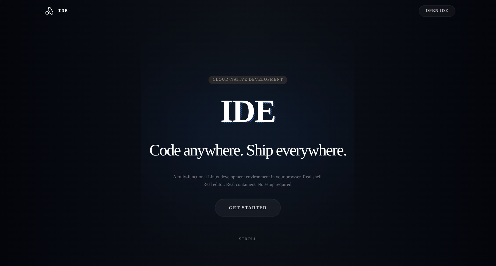

# Aks IDE

A cloud-based, browser-accessible development environment. Each user gets an isolated Docker container running a real Linux shell — install any tool, write code, and run it, all from the browser with **minimum setup required**.



## Demo Videos

- [Rust server branch demo](https://drive.google.com/file/d/1lsRfhyKzmDOu24aeY3xtF6QpcKJjdgNM/view?usp=sharing)
- [Legacy terminal module](https://drive.google.com/file/d/11ykA2aA7gbdgfaeedPh0G2Spd1P8DdyW/view?usp=sharing)

---

## Architecture

Three independent services communicate over HTTP and WebSocket:

| Service          | Language / Framework        | Port | Responsibility                                       |
| ---------------- | --------------------------- | ---- | ---------------------------------------------------- |
| `auth_service`   | Go                          | 8081 | Google OAuth, JWT issuance & rotation, user profiles |
| `ws_ide`         | Rust + socketioxide (Axum)  | 8084 | WebSocket hub — terminal, file I/O, Docker lifecycle |
| `aks_ide_client` | Next.js 16 + React 19 + Bun | 3000 | Browser IDE — editor, terminal, explorer             |

### ws_ide module layout

```text
ws_ide/src/
├── events/mod.rs                  # Typed socket event constants (incoming / outgoing)
├── socket_handler/
│   ├── mod.rs                     # Registers all socket event handlers
│   ├── load_terminal.rs           # Spins up a Docker container + PTY on connect
│   ├── pseudo_terminal.rs         # Streams PTY output back to the client
│   ├── terminal_events/
│   │   ├── terminal_input.rs      # Writes keystrokes to the PTY
│   │   ├── terminal_resize.rs     # Sends TIOCSWINSZ on window resize
│   │   └── close_terminal.rs      # Cleans up PTY and container state
│   ├── file_events/
│   │   ├── get_file_data.rs       # docker exec cat <path>
│   │   └── save_file_data.rs      # docker exec tee + mv (atomic write)
│   └── repo_events/
│       └── repo_structure.rs      # Single-level docker exec ls -la per request
├── docker_vm/create_container.rs  # Pulls image, runs container, persists container ID
├── state.rs                       # Shared DashMap state (sockets, terminals, containers)
└── types.rs                       # Payload structs for all socket events
```

---

## Features

### Terminal

- Real Linux shell (bash) inside an isolated Ubuntu Docker container per user
- PTY-backed I/O — resize, raw input, full colour output
- Multiple terminal tabs with independent sessions
- Pre-configured support for Node.js, Python, Rust, and more
- xterm.js frontend for rendering

### Code Editor

- Monaco Editor (same engine as VS Code)
- Multi-file tabs with unsaved-change indicators
- Breadcrumb showing the current file path
- Language auto-detected from file extension

### File Explorer

- **Lazy / on-demand loading** — only the current directory level is fetched; sub-directories load when expanded
- `node_modules`, `.git`, and other heavy directories are fully accessible — loaded on demand like everything else
- Fetched directories are cached permanently for the session (no re-fetch on collapse/expand)
- Navigate into any folder as root, go back to parent with one click, or type any absolute path directly
- Refresh re-fetches the root without clearing the cache

### Auth

- Google OAuth login via the Go auth service
- RS256 JWT access tokens with rotating refresh tokens
- Tokens stored in localStorage; auto-refreshed by the client

---

## Tech Stack

| Layer         | Technology                                       |
| ------------- | ------------------------------------------------ |
| Frontend      | Next.js 16, React 19, TypeScript, Tailwind CSS 4 |
| UI components | shadcn/ui, Radix UI, Lucide icons                |
| Code editor   | Monaco Editor (`@monaco-editor/react`)           |
| Terminal UI   | xterm.js + xterm-addon-fit                       |
| WebSocket     | socket.io-client ↔ socketioxide (Rust)           |
| Backend       | Rust (Axum), socketioxide                        |
| Auth service  | Go, PostgreSQL                                   |
| Containers    | Docker (Ubuntu base image)                       |
| Package mgr   | Bun (frontend), Cargo (Rust), Go modules         |

---

## Running the Project

### Prerequisites

- [Rust](https://www.rust-lang.org/) + Cargo
- [Go](https://golang.org/) 1.22+
- [Bun](https://bun.sh/) 1.x
- [Docker](https://www.docker.com/) (running and accessible to the current user)
- [PostgreSQL](https://www.postgresql.org/) at `localhost:5432`

### Clone

```bash
git clone https://github.com/Akash-Kumar-Sinha/Aks_ide.git
cd Aks_ide
```

### Option A — One command (recommended)

```bash
chmod +x run.sh
./run.sh
```

Runs migrations, then starts all three services. Press `Ctrl+C` to stop everything.

### Option B — Each service manually

**1. Database migration** (run once, or after schema changes)

```bash
cd auth_service
go run ./cmd/migrations
```

Creates tables: `users`, `profiles`, `providers`, `refresh_tokens`, `workspace_containers`.

**2. Auth service** (Go — port 8081)

```bash
cd auth_service
go run ./cmd/server
```

**3. WebSocket IDE server** (Rust — port 8084)

```bash
cd ws_ide
cargo run
```

**4. Frontend** (Next.js — port 3000)

```bash
cd aks_ide_client
bun install
bun run dev
```

Open `http://localhost:3000` in your browser.

### Port reference

| Service          | Port |
| ---------------- | ---- |
| `auth_service`   | 8081 |
| `ws_ide`         | 8084 |
| `aks_ide_client` | 3000 |

---

## Known Limitations

**Ephemeral container filesystem** — Docker containers are stateless by default. Files written during a session are lost if the container is removed. Persistent volume mounting is on the roadmap.

---

## Roadmap

| Status     | Feature                    | Description                                                            |
| ---------- | -------------------------- | ---------------------------------------------------------------------- |
| Planned    | Persistent storage         | Docker volume integration so user files survive container restarts     |
| Planned    | Cloud backup               | Optional S3 sync for automatic file backup across sessions             |
| Planned    | AI assistant               | Shell autocomplete, error explanation, and AI-suggested fixes via MCP  |
| Planned    | Multi-server orchestration | Horizontal scaling and distributed container scheduling                |
| Planned    | Desktop app                | Offline-capable wrapper — log in and code from anywhere                |
| Planned    | Real-time collaboration    | Shared sessions and live cursor presence for pair programming          |

---

## Contact

Questions, feedback, or collaboration: [aks.krsinha@gmail.com](mailto:aks.krsinha@gmail.com)
