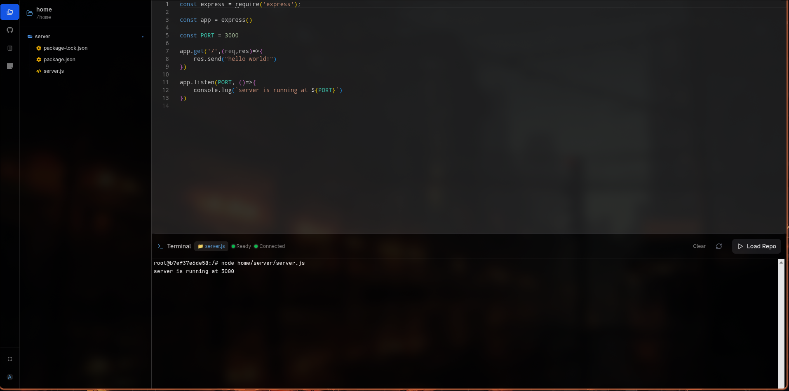

# 🧠 Aks IDE – Terminal Module

The **Terminal Module** is a core component of **Aks IDE** – a cloud-based, real-time development environment that gives developers access to a fully-functional Linux shell directly in their browser. This module serves as the foundation for code execution, file interaction, and developer tooling within the IDE.

---

- **Watch Aks IDE in Action – Rust Server Branch**  
  [Click to watch the demo video](https://drive.google.com/file/d/1lsRfhyKzmDOu24aeY3xtF6QpcKJjdgNM/view?usp=sharing)

- **Legacy Version**  
  This is the previous working version of the terminal module from the `main` branch.  
  [Click to watch the legacy demo](https://drive.google.com/file/d/11ykA2aA7gbdgfaeedPh0G2Spd1P8DdyW/view?usp=sharing)

---

## 📌 Current Capabilities

### ✅ Real-Time Shell Access

- Each session launches an **isolated Docker container** (Ubuntu-based).
- Executes a real Linux shell (typically `bash`) inside the container.
- Users can run commands, install packages (e.g., `node`, `python`), and execute scripts just like on a local system.

---

## ⚙️ Architecture Overview

| Component     | Technology                  |
| ------------- | --------------------------- |
| Backend       | Rust (Axum framework)       |
| Frontend      | React + xterm.js            |
| Communication | WebSockets (bi-directional) |
| Terminal Core | PTY (Pseudo-Terminal)       |

---

## 💡 Core Features

| Feature                     | Description                                                                     |
| --------------------------- | ------------------------------------------------------------------------------- |
| 🐧 **Real Linux Shell**     | Full-featured bash shell inside an Ubuntu-based Docker container.               |
| 🔄 **WebSocket I/O**        | Real-time terminal input/output via WebSocket.                                  |
| 🖥️ **xterm.js UI**          | Responsive terminal interface rendered in-browser using xterm.js.               |
| 🧱 **Single Terminal**      | One terminal session per user (multi-terminal support coming soon).             |
| 🛠 **Dev Tool Installation** | Users can install languages/tools (Node.js, Python, etc.) inside the container. |

---

## 🔮 Roadmap & Future Features

### 🗂️ 1. Multi-Terminal Support

- Multiple terminal instances via tabs or split panes.
- Support for:
  - Shared container across terminals.
  - Dedicated services per terminal (e.g., build, logs, DB shell).

### 📁 2. File System Access & Management

- In-browser visual file explorer with full CRUD.
- Features:
  - Browse files/directories.
  - Upload/download files.
  - Sync changes with terminal and editor in real time.

### 🧑‍💻 3. Embedded Code Editor

- Integrate **Monaco Editor** or **CodeMirror** for in-browser coding.
- Edit files that are instantly runnable in the terminal.
- Compile and run code without leaving the IDE.

### 🤖 4. AI Assistant (via MCP Server)

- AI features include:
  - Shell command auto-completion.
  - Real-time debugging and error explanation.
  - Optimizations and AI-suggested fixes.
  - Debug mode: auto-search errors and provide resolutions.

### 🐳 5. Run Docker & Databases Inside IDE

- Launch Docker containers from terminal sessions.
- Run databases like **PostgreSQL**, **MySQL**, **MongoDB** inside IDE.
- Lightweight browser-based GUI for database management.
- Simulate microservices and multi-container applications directly from the IDE.

### 🗂 6. Choose Your OS Environment

Currently, sessions run in Ubuntu-based containers, but soon we plan to let users choose their preferred OS image — whether it’s Debian, Alpine, Fedora, or others — tailoring their environment to specific development needs.

---

## ⚙️ Why Rust for the Backend?

- **System-level control**: Ideal for managing PTYs, IO streams, and long-running processes.
- **High performance**: Minimal memory usage and low latency.
- **Memory safety**: Eliminates entire classes of bugs common in JS/TS.
- **Binary data handling**: More robust than Node.js for binary streams and filesystem tasks.

> _The prototype built with Node.js faced challenges with binary data and stream stability. Rust resolves these with performance and safety guarantees._

---

## 🚧 Technical Challenges

### ❌ Ephemeral Docker Filesystem

- Docker containers are **stateless** by default – all session data is lost on shutdown.
- Limitations:
  - Files are not retained across sessions.
  - Makes project continuity and file storage unreliable.

### ✅ Planned Solutions

- Integration with:
  - External volumes for persistent storage.
  - Cloud storage (e.g., AWS S3) for file backups.
  - Database or object storage for session snapshots and state.

---

## 📦 Tech Stack Summary

| Layer         | Technology                           |
| ------------- | ------------------------------------ |
| Frontend      | React, xterm.js                      |
| Backend       | Rust (Axum)                          |
| Terminal Core | PTY (bash shell)                     |
| Containers    | Docker (Ubuntu base image)           |
| Communication | WebSocket                            |
| Editor        | Monaco Editor / CodeMirror (planned) |
| AI Assistant  | MCP Server, local LLMs (planned)     |
| File Storage  | Cloud Storage, S3, External Volumes  |

---

## 🚀 Vision

The Terminal Module aims to evolve into a full-stack **cloud-native development OS**:

- Seamless **code → compile → debug → deploy** lifecycle.
- Fully integrated **AI pair programming** and real-time collaboration.
- Developer environments without local setup – code instantly from anywhere.
- Local-first desktop application that connects to cloud infrastructure.

> _Just install our desktop app, log in, and start building – no setup required._

---

## 📬 Contact

Have questions, suggestions, or want to collaborate?

- ✉️ Email: [akashkumarsinha403@gmail.com]
- Blog: [https://akside.hashnode.dev/introducing-aks-ide-terminal-module]
